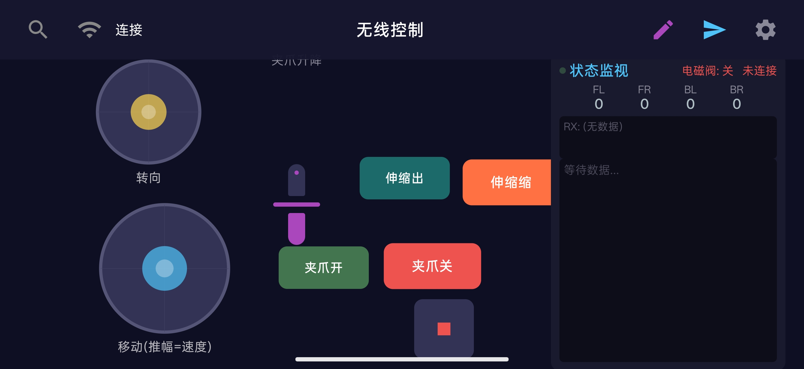

# 🚗 蓝牙控制 - 小车 Android App

基于 **Jetpack Compose** 打造的现代化蓝牙遥控 Android 客户端，专为 **STM32 小车**量身定制。具备高自由度的布局编辑、动态协议解析以及流畅的动画交互。



---

## ✨ 核心特性

* **🔌 蓝牙 SPP/BLE + WiFi TCP 双模连接** — 蓝牙模式稳定可用（HC-05/06、BLE）；WiFi TCP（DT-06）**目前存在停止不可靠问题，暂不可用**，正在排查中。
* **🕹️ 智能双虚拟摇杆** — 左摇杆控制移动（推幅自适应速度），右摇杆精准控制转向；松手自动补发 stop 帧，避免小车持续滑跑。
* **🦾 夹爪精准控制** — 滑块线性调节夹爪升降，电磁阀按钮一键控制夹爪开闭与点动。
* **📊 数据实时监视** — 动态显示四轮电机转速，内置数据接收日志与 RX 状态指示灯。
* **⌨️ 自定义命令发送** — 支持手动输入并发送任意协议指令，调试极度便利。
* **🛠️ 可视化协议编辑器** — 内置标准控制协议，支持在 App 内直接添加、修改自定义命令模板。
* **📐 自由画布布局编辑** — 开启编辑模式后，全界面控件支持**自由拖拽与缩放**，配置自动持久化，定制你的专属遥控面板。
* **📳 沉浸式交互反馈** — 深度整合 Compose 丝滑动画过渡，配合细腻的按键震动反馈（Haptic）。

---

## 🛠️ 技术栈

* **⚡ 核心架构：** Kotlin + Jetpack Compose (声明式 UI)
* **🎨 视觉规范：** Material 3 控件库 + Compose Animation 动画引擎
* **🔌 通信底座：** Bluetooth Classic SPP / BLE + WiFi TCP，由 ConnectionManager 统一抽象管理
* **📦 数据处理：** Gson 序列化 + SharedPreferences 布局与协议本地持久化

---

## 📜 通信协议规范

应用采用标准文本流协议，通过 `\r\n`（换行符）进行帧隔离。

### 📡 发送与接收格式

> **发送：** `[command,param1,param2,...]\r\n`
> **接收：** `[command,param1,param2,...]`

### 1. 内置控制命令表

| 命令 (Command) | 格式 (Format) | 参数说明 | 触发场景/作用 |
| --- | --- | --- | --- |
| **`joystick`** | `[joystick,lx,ly,rx,ry]` | `x, y` 范围：`-100 ~ 100` | 虚拟摇杆坐标变化时实时触发 |
| **`gripper`** | `[gripper,x_speed,y_speed]` | 速度范围：`-300 ~ 300` RPM | 夹爪升降控制 |
| **`valve`** | `[valve,on]` / `[valve,off]` / `[valve,toggle]` / `[valve,pulse,ms]` / `[valve,query]` | `pulse` 时长范围：`1 ~ 60000` ms | 电磁阀控制夹爪开闭/点动/状态查询 |
| **`query`** | `[query]` | 无参数 | 主动查询当前电机转速 |
| **`pid`** | `[pid,motor,kp*100,ki*100,kd*100]` | 参数放大了 100 倍的整型值 | PID 调参面板提交时发送 |
| **`plot`** | `[plot]` | 无参数 | 单次获取当前波形数据 |
| **`auto`** | `[auto]` | 无参数 | 开启定时自动发送（默认 100ms） |
| **`stop`** | `[stop]` | 无参数 | 停止定时自动发送 |

### 2. 下位机响应格式

* **`query` 响应：** `[s,speed0,speed1,speed2,speed3]` —— 返回四个电机的当前实时转速。
* **波形数据：** `[p,d0,d1,d2,d3]` —— 用于 `plot` 或 `auto` 模式下的动态数据流解析。
* **控制回显：** `[rx:<原始指令>]` —— 用于日志面板调试输出。
* **电磁阀状态：** `[valve:on]` / `[valve:off]` / `[valve:pulse]` / `[valve:error,...]` —— 夹爪电磁阀状态反馈。

---

## 🔧 自定义协议扩展

### 👨‍💻 代码方式注册

你可以在底层直接继承 `ProtocolHandler` 来扩展小车的功能：

```kotlin
val engine = ProtocolEngine()

engine.registerHandler(object : ProtocolHandler {
    override val command = "motor"
    override fun parse(params: List<String>) = { /* 解析下位机数据 */ }
    override fun serialize(message: ProtocolMessage) = { /* 序列化发送数据 */ }
})

```

### 📱 界面方式添加

无需重新编译！直接在 App 内的 **协议编辑器** UI 界面中，动态添加新指令并配置参数模板。

---

## 📂 项目目录结构

```text
app/src/main/java/com/fangzhou/carcontrol/
├── MainActivity.kt               # 应用入口，权限请求与主生命周期管理
├── MainViewModel.kt              # 核心状态机，连接 UI 与业务逻辑
├── bluetooth/
│   ├── BluetoothManager.kt       # 蓝牙连接管理（SPP/BLE Socket 读写线程）
│   ├── ProtocolEngine.kt         # 协议数据包解析与分发引擎
│   └── ProtocolCommandStore.kt   # 自定义协议本地持久化
├── connection/
│   ├── ConnectionManager.kt      # 蓝牙/WiFi 统一连接抽象与状态管理
│   └── ConnectionPreferences.kt  # 连接配置本地持久化（含 WiFi 波特率）
├── wifi/
│   ├── WifiManager.kt            # WiFi TCP 连接、自动重连与数据收发
│   └── WifiConfig.kt             # WiFi/DT-06 连接配置模型
├── layout/
│   └── LayoutConfig.kt           # 控件坐标、大小等自由布局配置模型
└── ui/
    ├── ControlPanel.kt           # 遥控主面板（包含自由画布）
    ├── JoystickPad.kt            # 自定义虚拟摇杆组件
    ├── DraggableWidget.kt        # 可拖拽、缩放的通用高阶容器
    ├── StatusDisplay.kt          # 仪表盘、数显与日志视图
    ├── BtConnectionDialog.kt     # 蓝牙设备搜索与选择弹窗
    ├── WifiConnectionDialog.kt   # WiFi 连接配置弹窗（IP/端口/波特率）
    ├── ProtocolEditorScreen.kt   # 协议动态编辑器界面
    ├── CustomCommandDialog.kt    # 快捷命令手动发送弹窗
    └── HapticManager.kt          # 触觉震动反馈管理工具

```

---

## ⚠️ 已知问题

* **WiFi 模式电机停止不可靠**：WiFi TCP（DT-06）模式下，摇杆松手后电机可能不停下来，急停也可能失效。蓝牙模式正常。原因怀疑是 WiFi TCP write 不阻塞导致帧突发，DT-06 透传到 UART 后帧间距过短，与固件的逐包处理+回显阻塞冲突。正在排查中，暂建议使用蓝牙模式。

---

## 🚀 编译与运行

1. 使用最新版本的 **Android Studio** 打开项目根目录。
2. 等待 Gradle 依赖同步（Sync）完成。
3. 连接手机或开启模拟器（需支持蓝牙），点击 **Run** 即可。

```toml
minSdk = 26     # Android 8.0 Oreo (保证蓝牙与高频动画性能)
targetSdk = 33  # Android 13

```


---

## 📄 开源协议

本项目基于 [MIT License](https://www.google.com/search?q=LICENSE) 协议开源。
